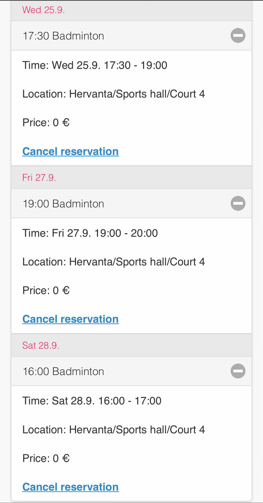

## SPORTUNI_RESEVATION
From a screenshot of the reservation page of SportUni as image.jpg, like [image.jpg](image.jpg), you can create calender invites in Google Calender.

Follow this [article](https://medium.com/@ayushbhatnagarmit/supercharge-your-scheduling-automating-google-calendar-with-python-87f752010375) to create a Google Calender API key and OAuth 2.0 credentials which you need to save as `credentials.json` in the same directory as the script.

You also need a `invited.json` file with the following format:
```json
{
    "email": "YOUR_INVITED_PERSONS_EMAIL",
}
```

Install the following dependencies with pip:
```bash
pip install pytesseract pillow google-api-python-client google-auth google-auth-oauthlib google-auth-httplib2
```

What these package do briefly:
- `pytesseract` is the Python wrapper for Tesseract, an OCR tool.
pillow is a Python imaging library. It's imported as PIL in your code.
- `google-api-python-client`, `google-auth`, `google-auth-oauthlib`, and `google-auth-httplib2` are libraries for using Google APIs.
- `re` (for regular expressions), `datetime`, `os.path`, `pickle`, and `json` are Python standard libraries. Among them, `pickle` is used to store the user's credentials for the Google API. Once the user has logged in for the first time, their credentials are pickled and saved to a file. Then, in future runs of the program, the credentials can be unpickled from the file, allowing the user to skip the login step.

> You also need to install Tesseract OCR on your system. You can download it from [here](https://tesseract-ocr.github.io/tessdoc/Installation.html) and install it. Make sure to add the path to the Tesseract executable to your system's PATH variable.

## YOUR FOLDER STRUCTURE SHOULD LOOK LIKE THIS
```bash
.
├── app.py
├── credentials.json
├── image.jpg
├── invited.json
└── README.md
```
### TO RUN THE SCRIPT
```bash
python app.py
```


## SAMPLE SCREENSHOT IMAGE
